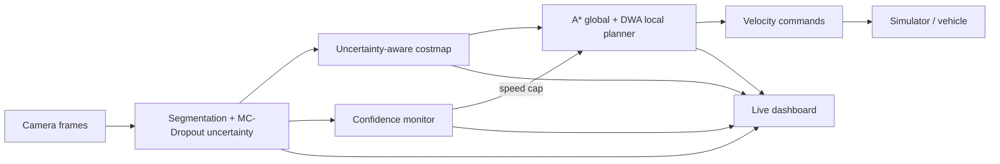

# DoubtNav

**A camera-only navigation system for unmanned ground vehicles (UGVs) that knows when it is unsure, and adapts.**


Built by **Team Phoenix** for the problem statement *Vision-Based Autonomous Navigation for Unmanned Ground Vehicle in Outdoor Environment*.

---

## Table of Contents

1. [The Problem](#the-problem)
2. [Our Approach](#our-approach)
3. [Architecture](#architecture)
4. [Features](#features)
5. [Quick Start](#quick-start)
6. [Project Structure](#project-structure)
7. [Benchmark Results](#benchmark-results)
8. [Known Limitations](#known-limitations)
9. [Roadmap](#roadmap)
10. [Credits](#credits)

---

## The Problem

Outdoor UGVs work in places where GPS is unreliable and the terrain is unpredictable: rocks, ditches, trees, mud, and changing light. Cameras are a cheap, information-rich sensor, but vision models trained on clean data degrade in fog, darkness, and glare. The dangerous part is that they usually degrade **silently**: the model keeps producing confident predictions that are wrong, and a standard planner trusts them.

## Our Approach

DoubtNav gives the vehicle a measure of its own doubt and feeds it into navigation:

- **Uncertainty from the model.** Monte Carlo (MC) Dropout on a YOLOv8 segmentation model estimates epistemic uncertainty per pixel, so the system knows not only what the network predicts but how much it is second-guessing itself.
- **Uncertainty in the costmap.** Regions the model is unsure about receive a higher traversal cost, so the planner prefers terrain it understands. Uncertainty is measured relative to the rest of the frame (`u_rel`), so a uniformly foggy scene does not make the whole map untraversable.
- **Confidence-governed speed.** A state machine tracks overall confidence over time and lowers the vehicle's maximum speed as visibility degrades.

## Architecture



| Module | What it does |
|---|---|
| **Perception** | Segments the scene into traversable, risky, obstacle, and blocked classes and estimates per-pixel uncertainty. |
| **Costmap** | Builds a top-down grid. Obstacles register instantly; free space decays over time. Cost combines class cost with relative uncertainty (`u_rel`), and obstacles are inflated by the vehicle radius. |
| **Planner** | A\* finds a global route; the Dynamic Window Approach (DWA) steers locally. The emergency stop depends on obstacle cost only, never on uncertainty. A stuck-recovery routine (rotate, back up, replan) handles local minima. |
| **Confidence monitor** | Aggregates frame-wide uncertainty with hysteresis to avoid mode flicker, and sets the speed cap. |
| **Dashboard** | Live camera overlay, uncertainty heatmap, costmap, trajectory, confidence gauge, and mode badge. |

### Operating modes

| Mode | Speed cap | Meaning |
|---|---|---|
| **Normal** | 100% | Clean visibility |
| **Cautious** | 60% | Moderate degradation |
| **Dead-reckoning** | 30% | Severe degradation; relies on odometry |

## Features

- Camera-only perception, with no GPS dependency
- Uncertainty-aware path planning with live replanning around sudden obstacles
- Automatic speed reduction when visual confidence drops
- Video Replay mode (real footage with Clear, Night, Fog, and Glare degradation)
- 2D Simulator mode (A to B navigation, obstacle injection, goal selection)
- Benchmark page that reads results directly from `backend/results.json`
- Runs on CPU

## Quick Start

**Requirements:** Python 3.10+ and Node.js 18+.

```bash
# 1. Install Python and npm dependencies and download model weights
make setup

# 2. Build the frontend and start the server
make run
```

Open **http://localhost:8000**.

The dashboard has three views:

- **Video Replay:** run the pipeline on a clip and switch the degradation (Clear, Night, Fog, Glare).
- **Simulator:** set a goal, watch the vehicle navigate, and drop an obstacle in its path.
- **Benchmark:** compare the baseline and DoubtNav across all scenarios.

To share a running instance over a temporary public link:

```bash
bash scripts/share.sh
```

(Requires [`cloudflared`](https://developers.cloudflare.com/cloudflare-one/connections/connect-networks/) to be installed.)

To reproduce the benchmark:

```bash
python scripts/benchmark.py
```

## Project Structure

```
doubtnav/
├── backend/          # FastAPI app, perception, localization, planning, simulator, results.json
├── frontend/         # React + Vite + Tailwind dashboard
├── data/clips/       # Sample video clips
├── scripts/          # Benchmark, run-on-video, tunnel helper
├── tests/            # Unit tests
└── Makefile          # setup, run
```

## Benchmark Results

We compared DoubtNav against a standard A\*/DWA baseline in a custom 2D kinematic simulator: **4 scenarios x 20 random seeds per system**, with the same step budget (3000 steps) for both.

| Scenario | System | Success | Collisions | Timeouts | Avg path (m) |
|:---|:---|---:|---:|---:|---:|
| **Clear** | Baseline | 100% (20/20) | 0 | 0 | 72.6 |
| | DoubtNav | 90% (18/20) | 0 | 2 | 78.8 |
| **Night** | Baseline | 100% (20/20) | 0 | 0 | 74.7 |
| | DoubtNav | 65% (13/20) | 1 | 6 | 67.4 |
| **Fog** | Baseline | 95% (19/20) | 1 | 0 | 70.2 |
| | DoubtNav | 30% (6/20) | 8 | 6 | 54.2 |
| **Sudden obstacle** | Baseline | 95% (19/20) | 1 | 0 | 70.5 |
| | DoubtNav | 90% (18/20) | **0** | 2 | 79.4 |

*Success = reached the goal within the step budget. Collisions = runs with at least one collision. Timeouts = runs that neither reached the goal nor collided.*

**What the results show:**

- In clear conditions and with a sudden obstacle, both systems navigate reliably, and DoubtNav completed the sudden-obstacle runs with no collisions.
- In simulated night and fog, DoubtNav currently performs **worse** than the baseline. See below.

## Known Limitations

- **Simulated night and fog do not hide obstacles.** In the 2D simulator, these conditions change only the uncertainty signal; obstacles remain geometrically visible to the planner. The baseline therefore loses nothing, while DoubtNav pays a cost for its caution. This setup cannot show a benefit from uncertainty-awareness, and the night and fog results should be read with that in mind.
- **Night and fog underperformance.** DoubtNav is slower and, in fog, less safe than the baseline in these tests. We are investigating the cause, including its stuck-recovery behavior.
- **Looping in some seeds.** Two clear-scenario seeds time out after long, looping paths. The stuck detector currently relies on vehicle velocity rather than progress toward the goal.
- **Simulation only.** Results come from a 2D simulator, not a physical vehicle.
- **Calibration.** Confidence thresholds were tuned on a small set of clips and need validation on more outdoor footage.

## Roadmap

- Model night and fog as real sensing degradation in the simulator (missed obstacles and noisier class predictions for both systems), so uncertainty-awareness can be evaluated fairly.
- Progress-based stuck detection and safer recovery maneuvers.
- Confidence thresholds that do not depend on a clip's own first frames.
- Visual odometry integration with place-recognition relocalization against stored image "breadcrumbs".
- A static, browser-only build of the dashboard for easy hosting.
- Deployment on edge hardware (Raspberry Pi / Jetson class).

## Credits

- **Team Phoenix**
- `driving_sample.mp4`: dashcam footage;
- `sample_rc_pov.mp4`: from the video "RC Car POV Camera Test / Offroad Adventure";
- Models and libraries: YOLOv8 (Ultralytics), PyTorch, OpenCV, FastAPI, React

Please check each third-party clip's license before redistributing it.